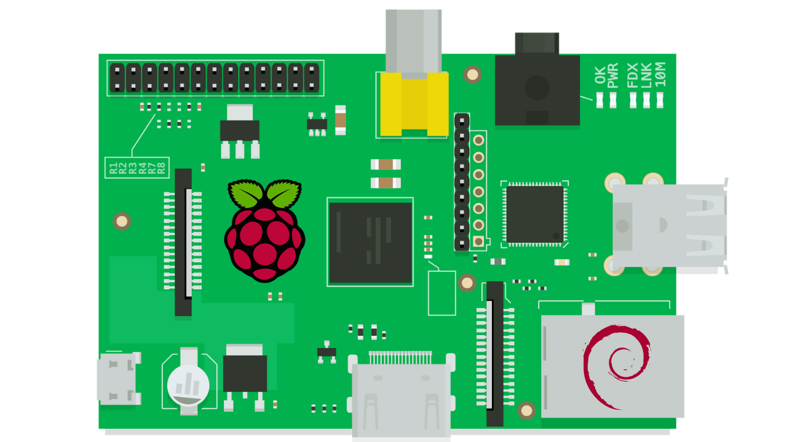

# **Make Debian for Raspberry Pi Build Again**
## **[GSoC’2025 | Debian](https://summerofcode.withgoogle.com/programs/2025/projects/JvTO8QWv)**

---

## About
- _Organization:_ [Debian](https://debian.org/)
- _GSoC contributor:_ [Kurva Prashanth](https://krvprashanth.in)
- _Mentor:_ [Gunnar Wolf](https://gwolf.org/) 
- _GSoC Entry link:_ [Program Project Page](https://summerofcode.withgoogle.com/programs/2025/projects/JvTO8QWv)
- _wiki.debian.org:_ [Make Debian for Raspberry Pi Build Again](https://wiki.debian.org/SummerOfCode2025/Projects#SummerOfCode2025.2FApprovedProjects.2FMakeDebianForRaspberryBuildAgain.Make_Debian_for_Raspberry_Build_Again)
- _Debian Salsa:_ [https://salsa.debian.org/krvprashanth](https://salsa.debian.org/krvprashanth)

---

